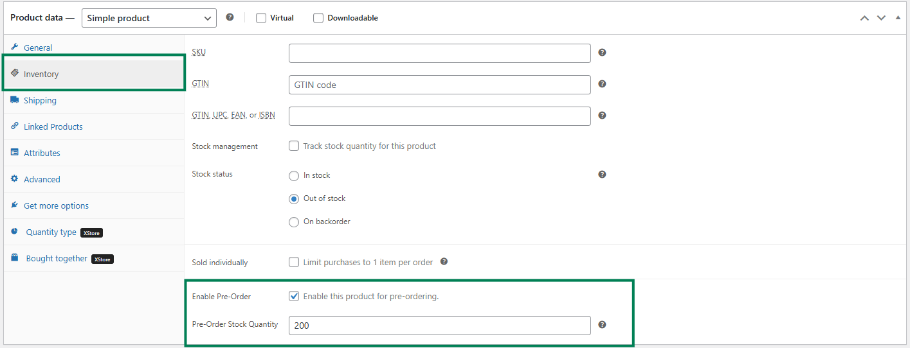
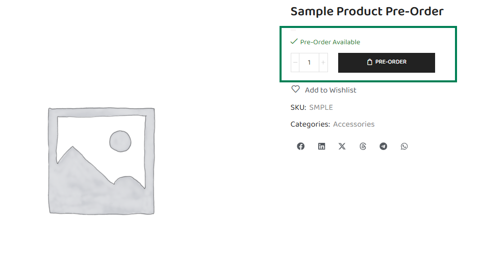
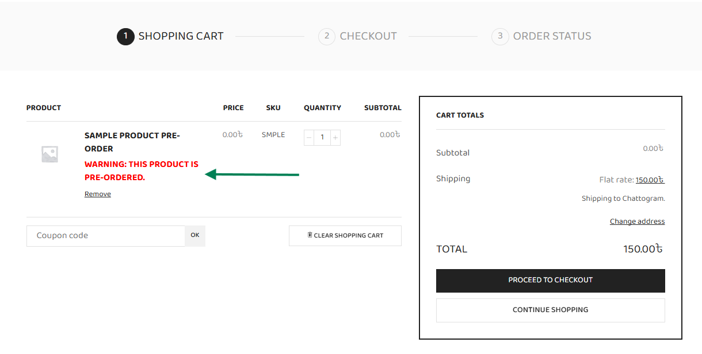
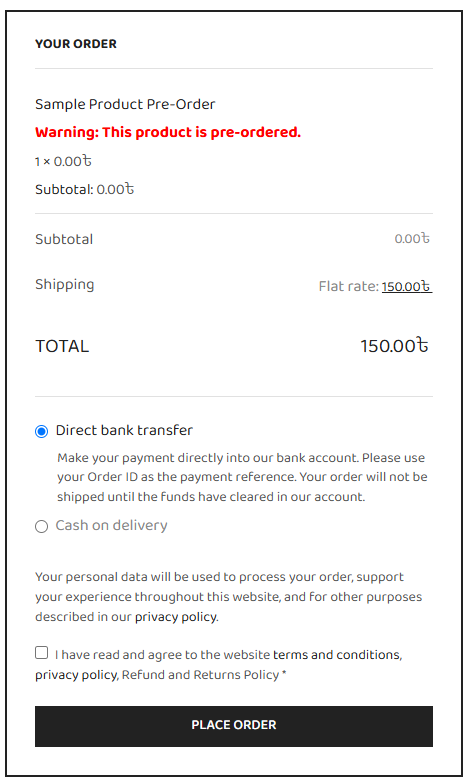
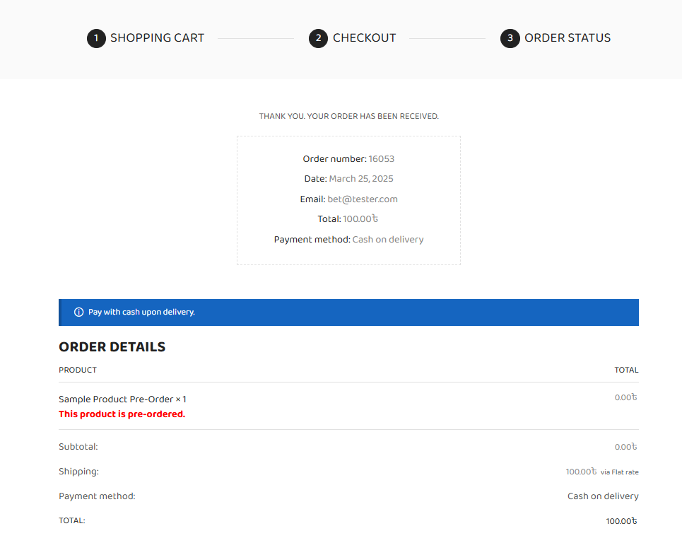
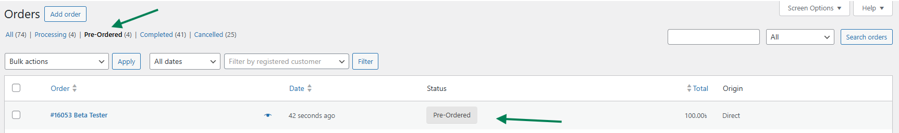
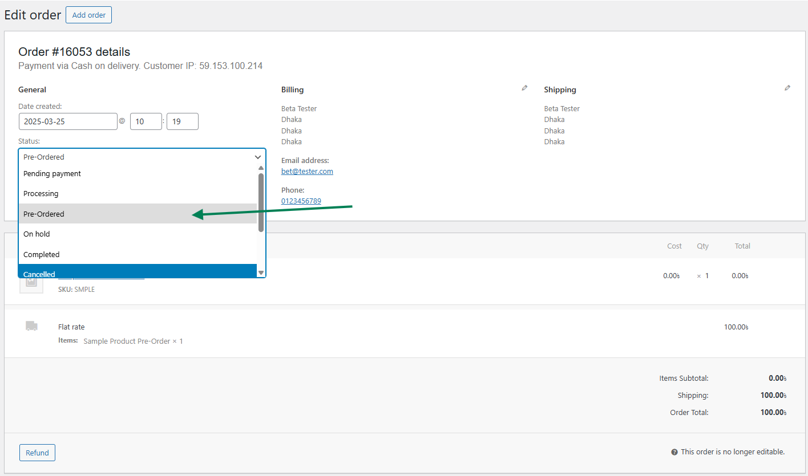
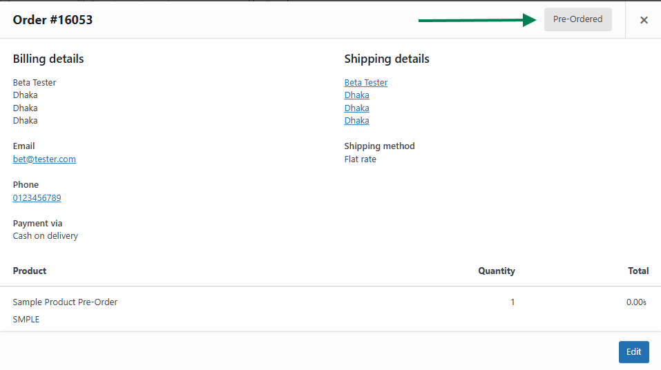

# WCQ Pre-Order for WooCommerce

**Plugin URI:** [https://github.com/cornQ/wcq-pre-order-for-woocommerce](https://github.com/cornQ/wcq-pre-order-for-woocommerce)  
**Author:** [Md. Sohanur Rahman Sakib](https://sakibsti.me/)  
**Version:** 2.4  
**Requires at least:** WordPress 6.7.2  
**Tested up to:** Latest WordPress  
**License:** GPLv3 or later  
**License URI:** [https://www.gnu.org/licenses/gpl-3.0.html](https://www.gnu.org/licenses/gpl-3.0.html)

---

## 📦 Description

**WCQ Pre-Order for WooCommerce** allows you to mark any product as pre-order from the Inventory tab on the product edit screen. When enabled, the standard **Add to Cart** button is replaced with a **Pre-Order** button, and orders are automatically set to a custom status: **Pre-Ordered**.

Whether you're launching new products or accepting purchases for out-of-stock items, this plugin helps you capture more orders and improve user experience.

---

## ✅ Features

- Enable **Pre-Order** on a per-product basis
- Show **"Pre-Order"** button instead of "Add to Cart"
- Automatically assign the **"Pre-Ordered"** order status
- Allow checkout even when the product is out of stock
- Set custom **Pre-Order stock quantity override**
- Hide "Buy Now" button for out-of-stock regular products
- Show warning message on cart and order pages
- Secure, lightweight, and compatible with most WooCommerce themes

---

## ⚙️ How to Use

1. Go to **Products > Edit Product**
2. Navigate to the **Inventory** tab
3. Check the box labeled **"Enable Pre-Order"**
4. (Optional) Enter a **Pre-Order Stock Quantity**
   - If left blank, defaults to `9999`

When customers view this product:
- They will see a **Pre-Order** button
- They can add it to the cart and checkout
- Orders containing this product will be marked as **Pre-Ordered**

---

## 💻 Installation

1. Download the plugin `.zip` file
2. In your WordPress dashboard, go to **Plugins > Add New > Upload Plugin**
3. Upload the ZIP file and click **Install Now**
4. Activate the plugin

---

## 🚧 Changelog

### 2.4
- Mismatched text domain fixed

### 2.3 
- Save issue fixed

### 2.2
- Final stable release
- Refined metadata and cleaned codebase

### 2.0 – 2.1
- Initial release of pre-order functionality
- Custom status, availability override, and order handling
- Support for hiding Buy Now buttons and displaying notices

---

## 📸 Screenshots

### 1. Inventory Section in Add/Edit Product Page

### 2. Product Page (Pre-Order Button)

### 3. Pre-order Warning on Cart Page

### 4. Pre-order Warning on Checkout Page

### 5. Pre-order Warning on Thank You Page

### 6. Pre-order Filter and Status on Orders Page (Admin Dashboard)

### 7. Pre-Ordered Product in Order Edit Mode

### 8. Pre-Ordered Product Summary in Order View

## 👨‍💻 Developer

**Md. Sohanur Rahman Sakib**  
🌐 [sakibsti.me](https://sakibsti.me)  
📦 [GitHub: @sakibstime](https://github.com/sakibstime)

---

## 📄 License

This plugin is licensed under the [GNU General Public License v3.0 or later](https://www.gnu.org/licenses/gpl-3.0.html).
